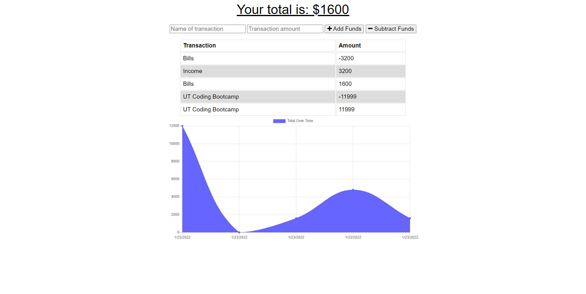
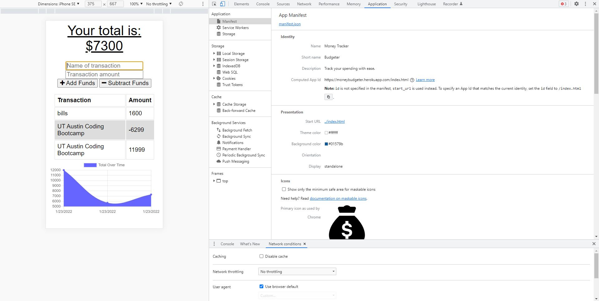

# Money Spending and Budget Tracker

## Purpose
To track finances visually and calculate them mathmatically. Even take them out if you like...

## Money Tracker

## Loaded Manifest and Offline Server

## Offline Functionality

## Built With
* MongoDB
* Mongoose
* JavaScript
* Node.js
* Express

## Website
https://moneybudgeter.herokuapp.com/

## License

#### License Link 🎫

- [License: MIT](LICENSE)

#### Badge 🏆

## Contribution
Made with ❤️ by Killian Chamberlain

### Your Budget Tracker